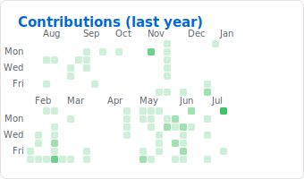
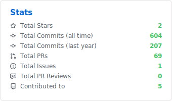
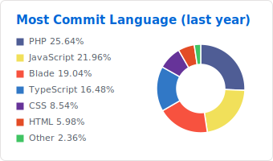
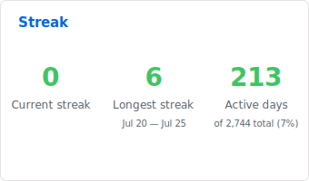
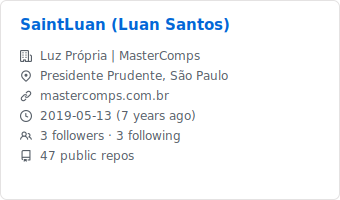

<div align="center">

# Luan Santos

**Full Stack Developer · PHP & Laravel · React & Next.js**

Building scalable web applications with clean architecture, performance, and maintainability in mind.

[](https://mastercomps.com.br)
[](https://www.linkedin.com/in/luan-santos-864693155/)
[](mailto:saint.business@hotmail.com)
[](https://www.mastercomps.com.br)

</div>

---

## About

```yaml
name: Luan Santos
role: Full Stack Developer
specialty: Front-end Specialist with strong PHP backend experience
experience: 6+ years in software development
education: Information Systems
location: Brazil
languages: Portuguese (native) · English (professional)
currently_at: Mastercomps
open_to: Full Stack · PHP · Laravel · React · Next.js roles
```

I started programming at **16** and have been shipping production software ever since — from institutional platforms and CMS-driven products to modern React/Next.js frontends.

I work end-to-end: **API design, database modeling, backend logic, UI implementation, and deployment**. Comfortable in legacy PHP stacks and modern JavaScript ecosystems.

---

## Core stack

### Backend


### Frontend


### Practices I care about
- MVC and service-layer architecture
- Readable, testable, and maintainable code
- Responsive UI and accessible interfaces
- Performance, caching, and database efficiency
- Secure authentication, permissions, and data handling

---

## What I deliver

| Area | Examples |
|------|----------|
| **Backend** | Laravel apps, REST APIs, admin panels, document workflows, role-based access |
| **Frontend** | React/Next.js SPAs, Blade templates, component-driven UI, Sass design systems |
| **Database** | Relational modeling, migrations, query optimization, structured content |
| **Integrations** | SMTP, reCAPTCHA, third-party APIs, file uploads, image processing |
| **DevOps** | Dockerized environments, Apache/PHP stacks, CI-friendly project structure |

Recent focus: **institutional platforms**, **CMS-backed content**, **multi-section document libraries**, and **admin dashboards** for business-critical operations.

---

## GitHub activity

Standard contribution timeline — including private repository activity when configured.

<div align="center">



<table>
  <tr>
    <td width="50%">



    </td>
    <td width="50%">



    </td>
  </tr>
  <tr>
    <td width="50%">



    </td>
    <td width="50%">



    </td>
  </tr>
</table>

</div>

> Cards are generated automatically by GitHub Actions. Private activity is included via PAT — see setup below.

---

## Highlights

- **6+ years** building web products in production environments
- Strong in **PHP/Laravel** backends with **React/Next.js** frontends
- Experience with **CMS**, **permissions**, **SEO**, **sitemaps**, and **content-heavy sites**
- Comfortable working with **legacy and modern stacks** in the same codebase
- Used to **client-facing delivery**, deadlines, and iterative product evolution

---

## Let's connect

<div align="center">

[](https://www.linkedin.com/in/luan-santos-864693155/)
[](mailto:saint.business@hotmail.com)
[](https://www.mastercomps.com.br)

</div>

---

<details>
<summary><strong>Setup — private contributions on the standard GitHub timeline</strong></summary>

### 1. Enable private contributions on GitHub

1. Open your [GitHub profile](https://github.com/SaintLuan)
2. Above the contribution graph, click **Contribution settings**
3. Enable **Private contributions**

This shows anonymized activity from private repos on the official profile graph. No code or repo names are exposed.

### 2. Generate the heatmap cards in this README

1. Create a public repository named **`SaintLuan`** (same as your username)
2. Copy this `README.md` and `.github/workflows/ghstats.yml` into it
3. Create a [classic Personal Access Token](https://github.com/settings/tokens/new) with scopes **`read:user`** and **`repo`**
4. In the repo, go to **Settings → Secrets and variables → Actions**
5. Add secret **`GHSTATS_TOKEN`** with your PAT
6. Run the workflow manually: **Actions → ghstats → Run workflow**

After the first run, the standard **7×53 contribution grid** appears in this README with private repo activity included.

</details>
